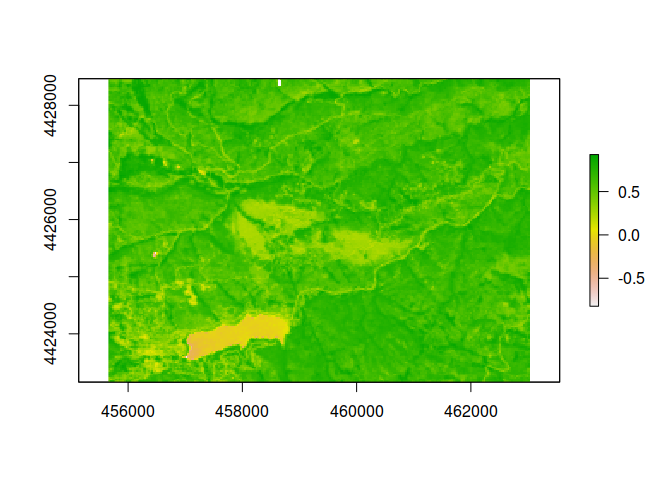
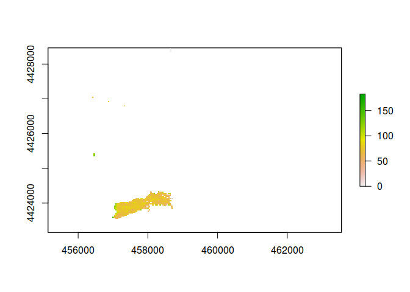
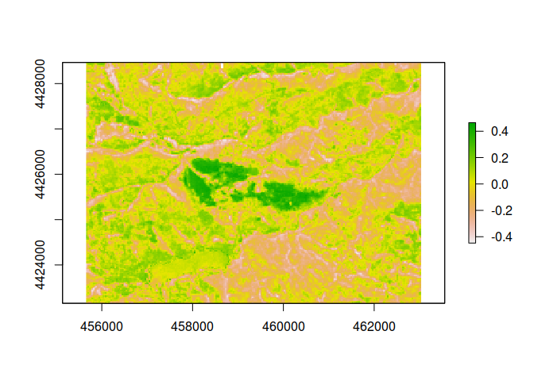
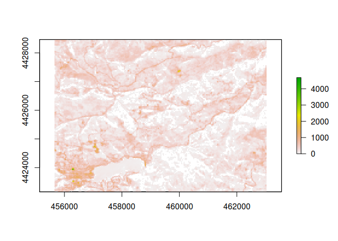
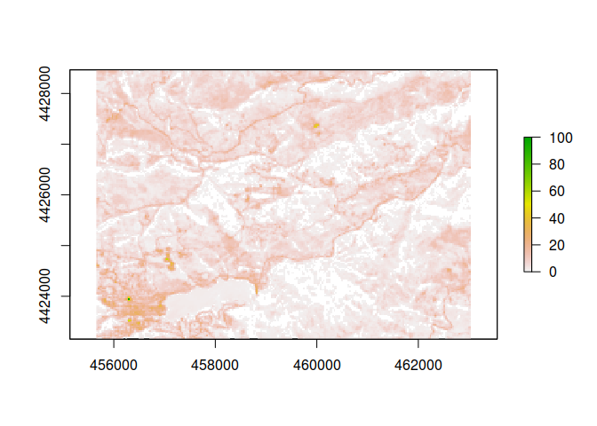
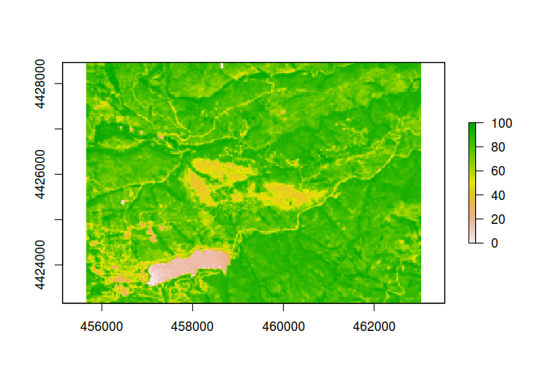
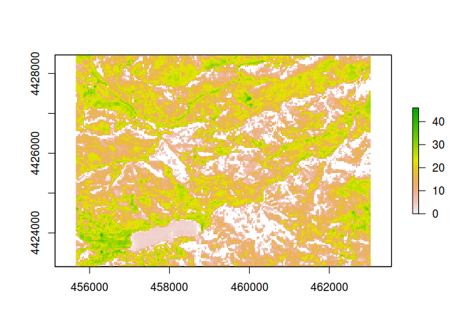

---
author:
- MABILA N. René-Jubilé
authors:
- MABILA N. René-Jubilé
editor: visual
title: Get Forest Canopy density
toc-title: Table of contents
---

# Analyse de la densité du couvert forestier (FCD) avec Landsat

## Introduction

    Ce document vise à expliquer les étapes nécessaires pour calculer la densité du couvert forestier (FCD) en utilisant des données d'imagerie Landsat. Nous allons passer en revue la préparation des données, le calcul des indices de végétation et finalement, le calcul du FCD.

## Preparation des données

    La première étape dans notre analyse consiste à préparer nos données. Cela inclut le chargement des données d'imagerie Landsat et la préparation de ces images pour l'analyse.

## Normalisation des noms des bandes

Pour faciliter l'analyse et améliorer la lisibilité du code, nous
normalisons les noms des bandes dans notre objet `brick`.

::: cell
``` {.r .cell-code}
# remove the filename from each band name for pretty plotting
names(landsat_csf_br) <- gsub(pattern = "LC80340322016189LGN00_sr_", replacement = "", names(landsat_csf_br))
```
:::

## Calcul des indices

::: cell
``` {.r .cell-code}
#Normalized Difference Vegetation Index (NDVI) 
ndvi <- (landsat_csf_br[[5]]-landsat_csf_br[[4]])/(landsat_csf_br[[5]]+landsat_csf_br[[4]])
plot(ndvi)
```

::: cell-output-display

:::

``` {.r .cell-code}
# advanced vegetation index (AVI)
avi <- (landsat_csf_br[[5]] * (1 - landsat_csf_br[[4]]) * (landsat_csf_br[[5]] - landsat_csf_br[[4]]))^(1/3)
plot(avi)
```

::: cell-output-display

:::

``` {.r .cell-code}
#Bar Soil Index (bsi)
# plot(bi)
bsi <- ((landsat_csf_br[[6]] + landsat_csf_br[[4]]) - (landsat_csf_br[[5]] + landsat_csf_br[[2]]))/((landsat_csf_br[[6]] + landsat_csf_br[[4]]) + (landsat_csf_br[[5]] + landsat_csf_br[[2]]))
plot(bsi)
```

::: cell-output-display

:::

``` {.r .cell-code}
# Shadow Index (SI)
si <- sqrt((256 - landsat_csf_br[[3]]) * (256 - landsat_csf_br[[4]]))
```

::: {.cell-output .cell-output-stderr}
    Warning in sqrt(getValues(x)): Production de NaN
:::

``` {.r .cell-code}
plot(si)
```

::: cell-output-display

:::

``` {.r .cell-code}
#ssi
si_min <- minValue(si)
si_max <- maxValue(si)
ssi <- (si - si_min) / (si_max - si_min) * 100
plot(ssi)
```

::: cell-output-display

:::

``` {.r .cell-code}
#mndvi
mndvi <- (ndvi* landsat_csf_br[[5]]-landsat_csf_br[[4]])/(ndvi * landsat_csf_br[[5]]+landsat_csf_br[[4]])
minValue(mndvi)
```

::: {.cell-output .cell-output-stdout}
    [1] -1.414183
:::

``` {.r .cell-code}
plot(mndvi)
```

::: cell-output-display

:::

``` {.r .cell-code}
# Define the minimum and maximum values of the original range
min_original <- minValue(mndvi)
max_original <- maxValue(mndvi)

# Define the new minimum and maximum values for the 0-100 percent range
min_new <- 0
max_new <- 100

# Calculate the rescaled MNDVI values
r_mndvi <- ((mndvi - min_original) / (max_original - min_original)) * (max_new - min_new) + min_new
plot(r_mndvi)
```

::: cell-output-display

:::
:::

## Calcul du FCD

Le FCD est un indice composite calculé à partir de plusieurs autres
indices, y compris le NDVI et le SSI (Standardized Shadow Index). Voici
comment nous le calculons :

::: cell
``` {.r .cell-code}
# Calcul du Forest Canopy Density
fcd <- sqrt(r_mndvi * ssi + 1) - 1
plot(fcd)
```

::: cell-output-display

:::
:::
